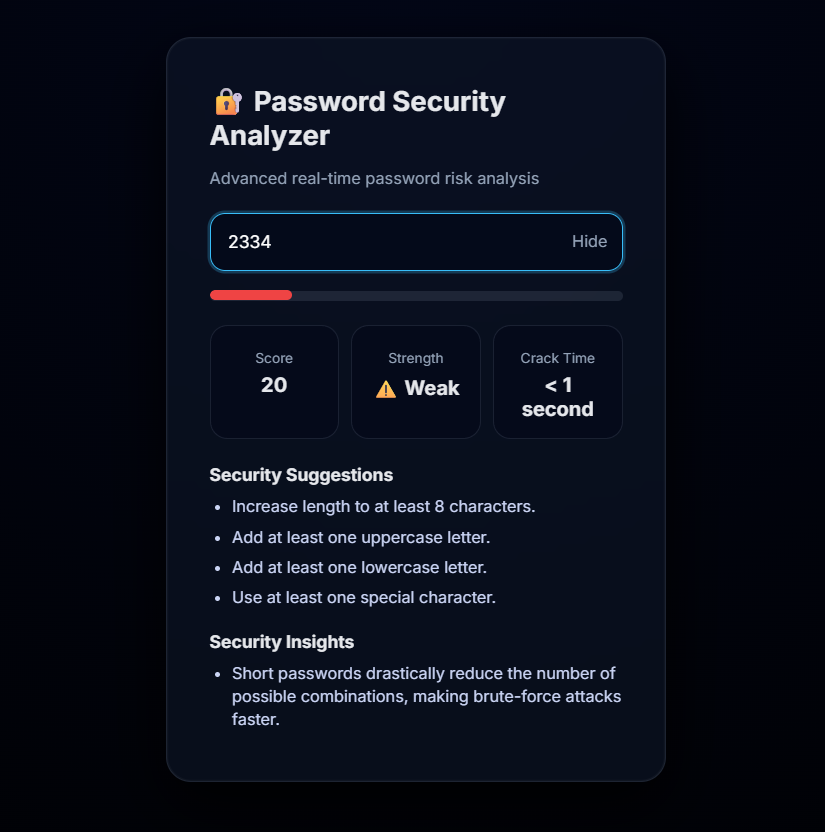

<h1 align="center">🔐 Password Security Analyzer</h1>

<p align="center">
  Security-Focused Real-Time Password Strength & Risk Analyzer
</p>

---

A modern, security-focused password strength analyzer that evaluates passwords in real time using rule-based validation, pattern detection, entropy-based crack-time estimation, and actionable security insights — presented with a professional, product-grade web UI.

---

## 🚀 Features

### ✅ Core Security Analysis
- Password length validation
- Uppercase, lowercase, digit, and special character checks
- Real-time strength scoring (0–100)
- Strength classification:
  - ⚠️ Weak  
  - 🟡 Medium  
  - 🟢 Strong  
  - 🔒 Very Strong  

---

### 🧠 Advanced Security Intelligence
- Detection of weak patterns (sequences, repeated characters)
- Common password detection using an external dataset
- Entropy-based crack-time estimation (GPU brute-force model)

---

### 💡 User Guidance
- Clear improvement suggestions
- Security insights explaining *why* a password is weak
- Breach-style warning for predictable or common passwords

---

### 🎨 Professional Web Interface
- Dark-mode, glassmorphism UI
- Animated strength meter
- Live feedback while typing
- Password visibility toggle
- Clean SaaS-style layout

---

## 🔐 Security Perspective

This analyzer models how attackers evaluate password strength by considering:

- Character set size (lowercase, uppercase, digits, symbols)
- Password length
- Predictable patterns (sequences, repeated characters)
- Common password databases
- Estimated GPU-based brute-force attack speeds

Crack-time estimation is calculated using entropy principles to simulate realistic attack scenarios.

The goal is not only to rate passwords, but to explain structural weaknesses and promote security awareness.

---

## 🖥️ Tech Stack

### Backend / Logic
- Python
- Regex-based validation
- Modular architecture (validator, scorer, patterns, suggestions)

### Frontend
- HTML5
- CSS3 (Glassmorphism, animations)
- Vanilla JavaScript (real-time analysis)

---

## 📸 Preview

### Weak Password Example


### Medium Password Example


### Very Strong Password Example


---

## 📂 Project Structure

```bash
password-security-analyzer/
│
├── src/
│   ├── validator.py
│   ├── scorer.py
│   ├── patterns.py
│   └── suggestions.py
│
├── data/
│   └── common_passwords.txt
│
├── web/
│   ├── index.html
│   ├── style.css
│   └── script.js
│
├── screenshots/
│   ├── weak-password.png
│   ├── medium-password.png
│   └── strong-password.png
│
├── main.py
└── README.md

▶️ How to Run

🌐 Web Version

Open web/index.html in your browser

Start typing a password to see real-time analysis

🖥️ Python (CLI Version)
python main.py
